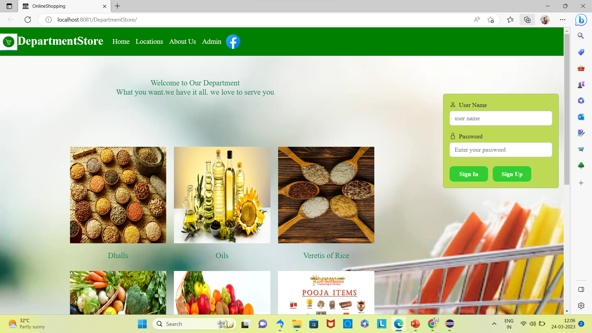
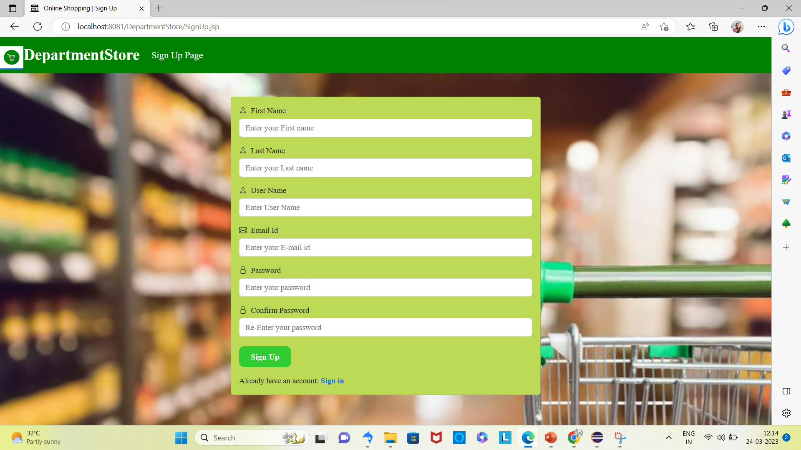
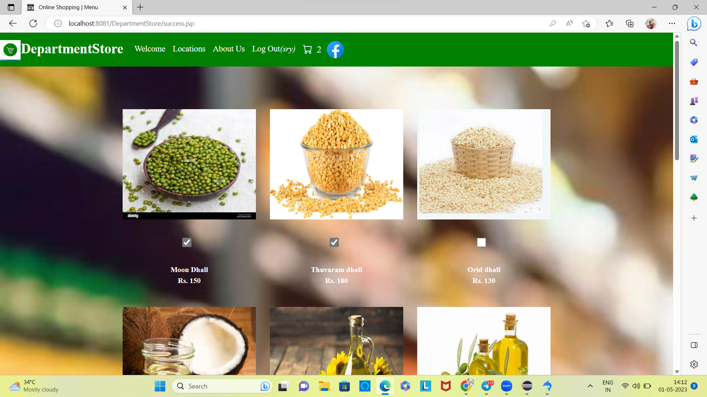
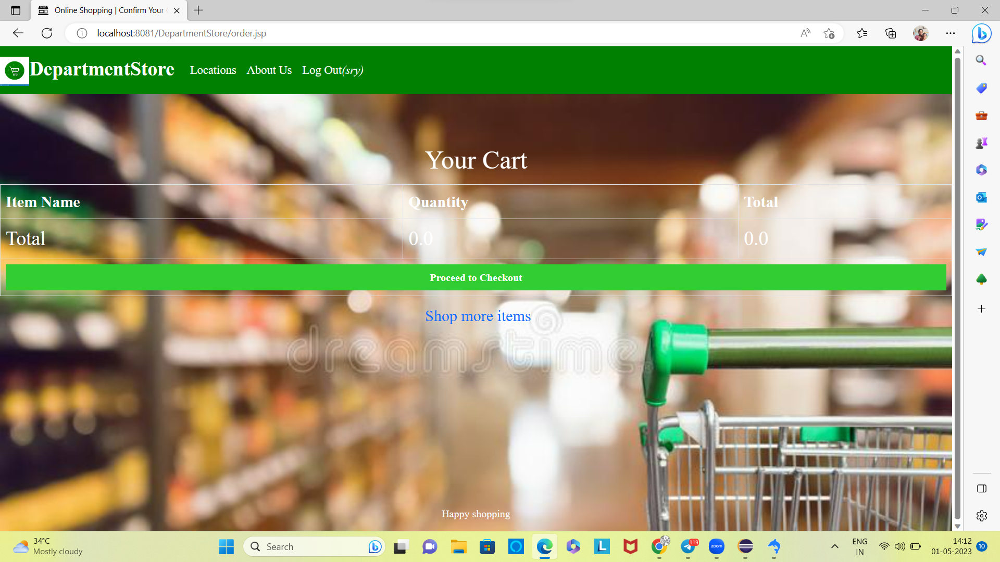
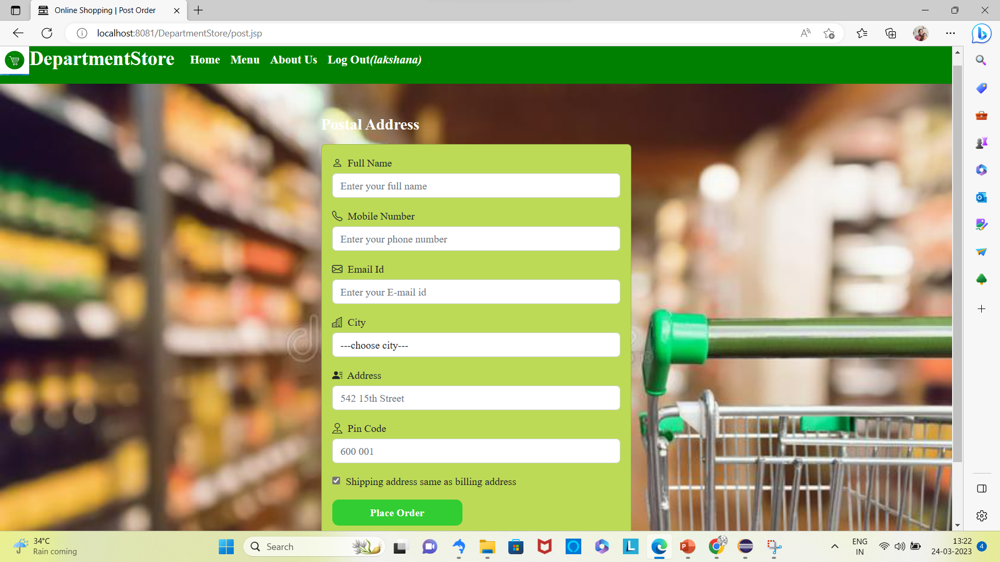
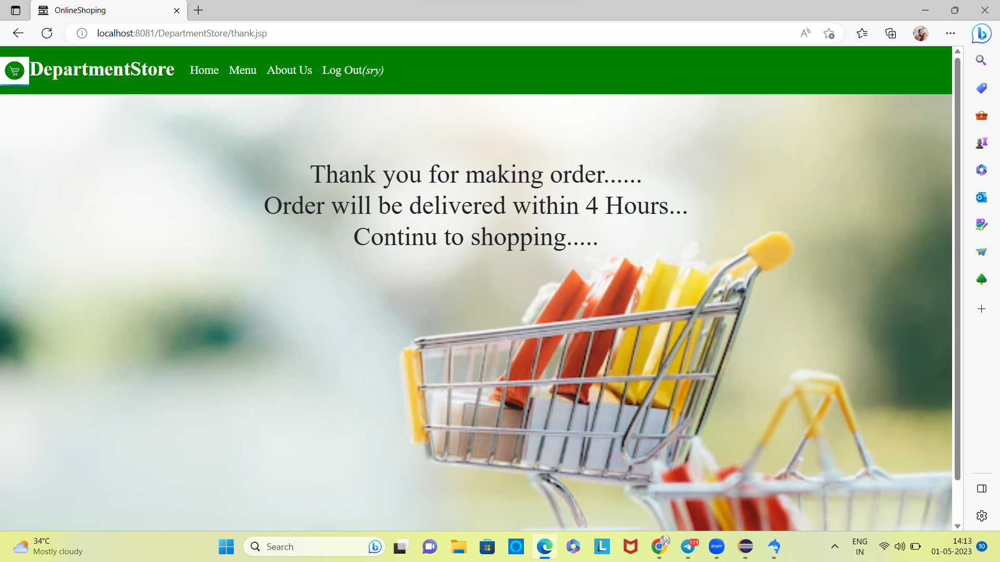
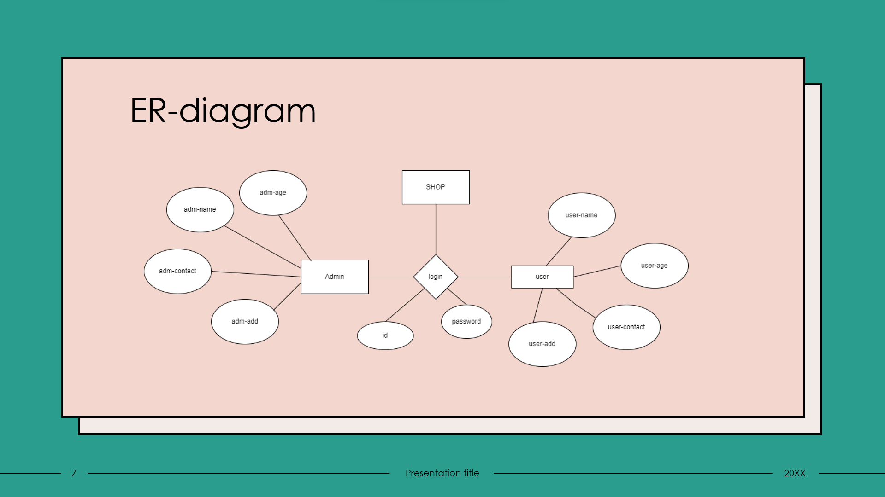

# DepartmentStore

# Project-documentation

  

<h3 align="center">OnlineShopping</h3>

      

## 📝 Table of Contents
- [About](#about)
- [Getting Started](#getting_started)
- [Deployment](#deployment)
- [Usage](#usage)
- [Flow Chart](#flowchart)
- [Contributing](../CONTRIBUTING.md)
- [Authors](#authors)
- [Acknowledgments](#acknowledgement)
## 🧐 About 
The business-to consumer aspect of an online shopping is the most visible business use of the world wide web is a responsive DepartmentStore online shoppinp website. The technologies used in this project are HTML, CSS, Bootstrap and Vanilla JavaScript . There are a few important modules in the project like home page, Menulist, menuform, Product-image, cart page, wishlist page etc. The data is accessed using ajax call and then rendered into the webpage using dynamic html template created using string literals. For cart-page we are using localstorage to temporarily storing data before clicking on the checkout button. I took almost 40 - 50 hrs to complete this project. SkillLync helped me by providing the wire-frames for all relevant feature pages main feture

## 🏁 Getting Started 
These instructions will get you a copy of the project up and running on your local machine for development and testing purposes.
1. DepartmentStore the repository and navigate to the root directory.
Getting started with Servlets in Tomcat involves the following general steps:

2. Install Tomcat: Download the latest version of Apache Tomcat from the official website and follow the installation instructions to install it on your system.

3. Create a web application: Create a new directory for your web application and create a WEB-INF directory inside it. Inside the WEB-INF directory, create a web.xml file, which will contain the configuration for your application. Also, create a classes directory for your Java classes and a lib directory for your Java libraries.

4. Create a Servlet: Create a new Java class that extends javax.servlet.http.HttpServlet. This class will implement the logic for your servlet. You can override methods such as doGet() and doPost() to handle HTTP requests.

5. Compile and package the application: Compile your servlet class and any other Java classes you have created for your application. Package your compiled classes and any libraries you are using into a WAR file. Place the WAR file in the webapps directory of your Tomcat installation.

6. Start Tomcat: Start Tomcat by running the startup.bat or startup.sh script in the bin directory of your Tomcat installation.

7. Test your application: Open a web browser and navigate to http://localhost:8081/DepartmentStore/. 

Overall, getting started with Servlets in Tomcat involves setting up a basic web application structure, creating a Servlet class, compiling and packaging the application, and deploying it to Tomcat. With these steps, you can create and deploy a simple Servlet-based web application.

### <b>Prerequisites</b>
What things you need to install the software and how to install them.

we have install JEE servlet apacheTomcat 9,mysql,jsp,eclips

### <b>Installing</b>
A step by step series of examples that tell you how to get a development env running.

1. Download Tomcat: Go to the official Apache Tomcat website and download the latest version of Tomcat.
    http://tomcat.apache.org/download-90.cgi

2. Install Tomcat: Follow the instructions provided by the Tomcat website to install Tomcat on your system.

3. Set up your development environment: Install a Java Development Kit (JDK) and an Integrated Development Environment (IDE) such as Eclipse or IntelliJ IDEA.
     https://www.eclipse.org/downloads/download.php?file=/oomph/epp/2023-03/R/eclipse-inst-jre-win64.exe

4. Create a new web application: In your IDE, create a new dynamic web project and set up the web application directory structure.

5. Create a Servlet: Create a new Servlet class that extends javax.servlet.http.HttpServlet.

6. Configure the Servlet: In the web.xml file, configure the Servlet by mapping its URL pattern to a specific URL path.

7. Compile the Servlet: Compile the Servlet class using the javac command or by using the build tool of your choice.

8. Package the web application: Package the compiled Servlet class and any other web resources into a WAR (Web Application Archive) file.

9. 
Test the Servlet: Open a web browser and navigate to the URL that you mapped your Servlet to in the web.xml file. You should see the response generated by your Servlet.

These are the basic steps for installing and setting up a Servlet in Tomcat. Once you have completed these steps, you can further customize your Servlet-based web application by adding additional Servlets, JSP pages, and other web resources.

## 🎈 Usage 
Servlets are Java classes that are used to extend the functionality of web servers such as Tomcat. They are typically used to create dynamic web content, such as generating HTML pages on the fly or processing user input from web forms.

Here are some examples of how servlets can be used in Tomcat:

1. Handling HTTP requests: Servlets can be used to process incoming HTTP requests from web clients, such as web browsers or mobile devices. They can extract information from the request, such as headers and parameters, and generate a response that is sent back to the client.

2. Generating dynamic content: Servlets can generate dynamic content in response to user requests. For example, a servlet can retrieve data from a database, process it, and generate an HTML page that is sent back to the client.

3. Processing form data: Servlets can handle form data submitted by users. They can extract the form data from the request and process it, for example by storing it in a database or sending it as an email.

4. Managing user sessions: Servlets can manage user sessions, which allow web applications to keep track of user activity across multiple requests. Servlets can create, retrieve, and update session data, and can also set session timeouts and invalidate sessions.

To use a servlet in Tomcat, you first need to create a Java class that extends the javax.servlet.http.HttpServlet class, and override one or more of its methods, such as doGet() or doPost(), to handle HTTP requests. You then need to package the servlet class in a WAR (Web Application Archive) file, which can be deployed to Tomcat using its web administration interface or by copying the WAR file to the Tomcat webapps directory. Once the WAR file is deployed, the servlet can be accessed using a URL that corresponds to the servlet's mapping in the web application's deployment descriptor (web.xml).

## 🚀 Deployment 

To deploy a servlet on Apache Tomcat, you can follow these general steps:

Build your servlet and create a WAR (Web Application Archive) file. A WAR file is a standard format for packaging web application files, including servlets, JSP files, HTML files, and other resources.

Copy the WAR file to the Tomcat webapps directory. This directory is located inside the Tomcat installation directory.

Start Tomcat by running the startup.sh script on Linux/Unix or startup.bat on Windows. This script is located in the bin directory of the Tomcat installation.

Once Tomcat is running, you can access your servlet by opening a web browser and navigating to the URL http://localhost:8080/<your-war-file-name>/<servlet-path>.

<h3>Homepage</h3> 
      
 <h3>SignupPage</h3> 
     
 <h3>MenuPage</h3> 
      
 <h3>OrderPage</h3> 
     
 <h3>Delivery Address Page</h3> 
      
  <h3>ThankYouPage</h3> 
   

## ⛏ Flow Chart 

  

- [Mysql](https://www.mysql.com/) - Database
- [Express](https://expressjs.com/) - Server Framework
- [VueJs](https://vuejs.org/) - Web Framework

## ✍️ Authors 
- [@SkillLync](https://github.com/kylelobo) - FSD

## 🎉 Acknowledgements 

I would like to thank the following individuals for their contributions to this project:

- The team at Skill-Lync, for generously providing the data used in this project.

